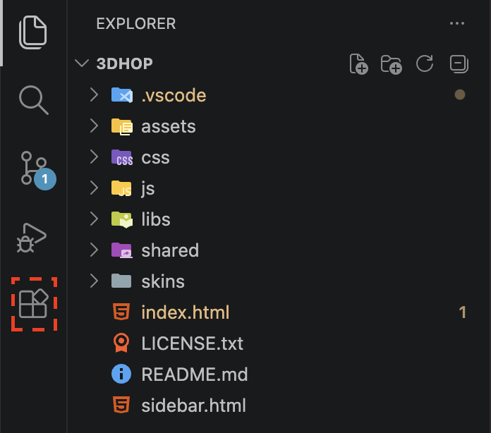
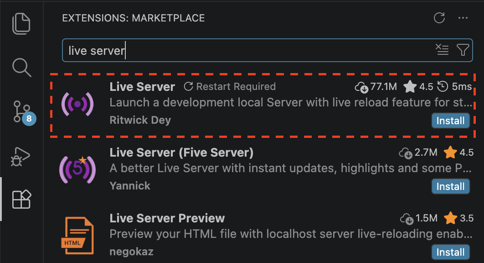
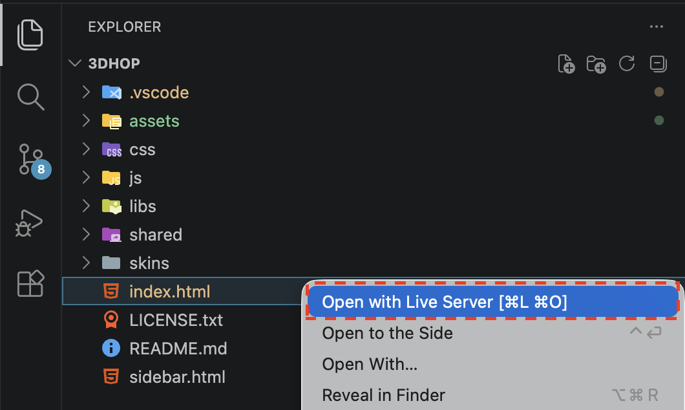
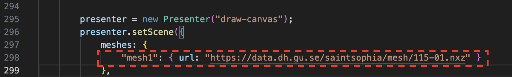
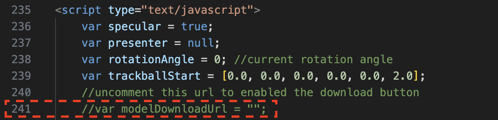

**3DHOP**
=========
3D Heritage Online Presenter
----------------------------
***3DHOP is an open-source software package for the creation of interactive Web-based presentations of high-resolution 3D models***  

[3DHOP](http://www.3dhop.net) by [Visual Computing Laboratory](http://vcg.isti.cnr.it) - ISTI - CNR

Contact Us @ info@3dhop.net

16 June 2020

#### Getting Started
1. Click the extensions tab on the left toolbar.

2. Search for and then install the [Live Server](https://marketplace.visualstudio.com/items?itemName=ritwickdey.LiveServer) plug-in.

3. Right-click on the `index.html` file and select **Open with Live Server**.

Your browser will automatically open the application.

Change the model by adjusting this line in index.html.

Uncomment this line and add the link to your model in order to enable downloads. 
